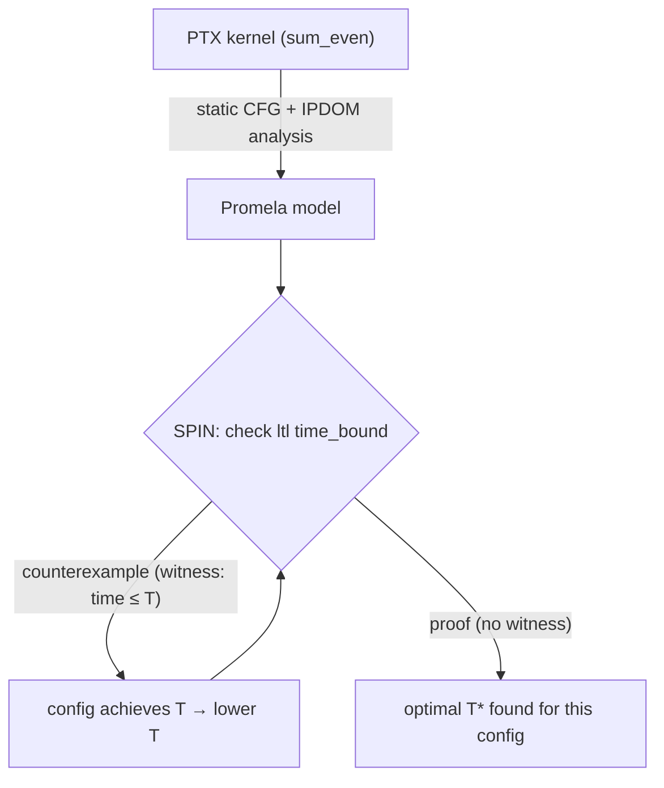
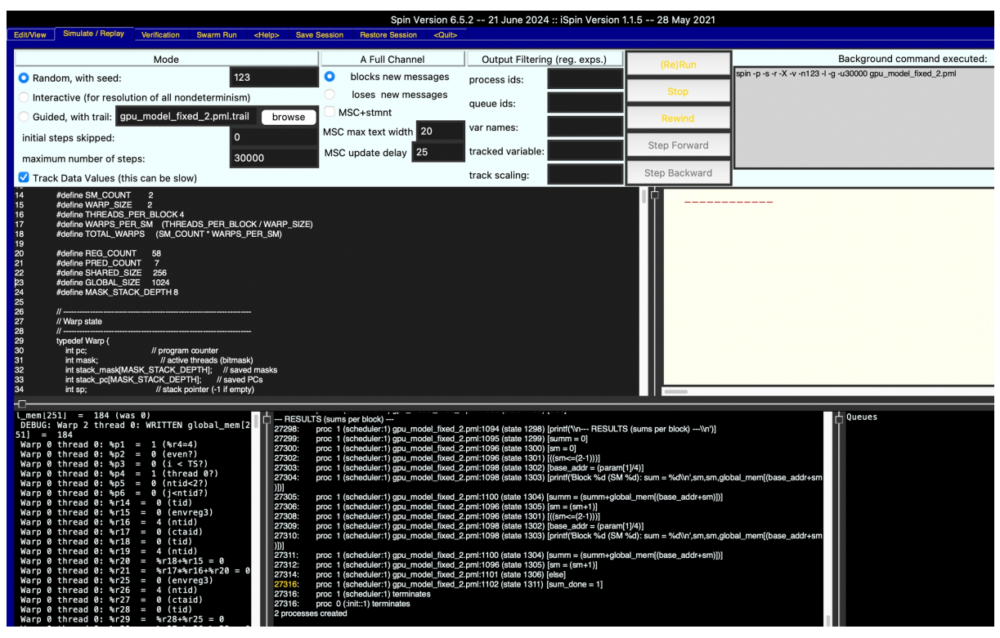

# SIMT-Formal 🧮 — Formal modeling of the pipeline of a modern graphics processor

**Exhaustive formal verification of a SIMT pipeline (warps, divergence, SIMT-stack, barriers, memory latency) with the [SPIN](https://spinroot.com) model checker — plus automatic launch-configuration search via *inverse Model Checking*.**


---

## 📖 Overview

Modern GPUs hide memory latency behind **massive thread-level parallelism**: thousands of threads are grouped into *warps* that execute one instruction at a time (SIMT). Branch divergence, memory patterns and launch parameters (`block size`, `blocks per SM`) make performance extremely sensitive to configuration — and manual tuning or profiling gives **no guarantees**.

This project takes a different route: it builds an **executable formal model** of a streaming multiprocessor (SM) in **Promela** and verifies it **exhaustively** with **SPIN**. Not "we tested a few scenarios" — but *"the property holds in **all** reachable states, under **all** interleavings and **all** cache hit/miss scenarios"*.

The verified kernel is `sum_even` (even-number reduction with divergence, barriers and shared memory), originating from the [VeHa-2024 formal verification contest](https://doi.org/10.15514/ISPRAS-2025-37(1)-10).

### What's inside

- ✅ **Cycle-approximate SIMT pipeline model**: round-robin warp scheduler, activity masks, SIMT-stack with reconvergence points, `bar.sync` cross-warp barriers, shared/global memory with nondeterministic hit/miss latency.
- ✅ **PTX-faithful instruction semantics**: `ld/st.global/shared`, `add`, `and`, `setp`, `selp`, `bra`, `bra.uni`, `bar.sync`, `ld.param` — with a full PTX→Promela traceability table.
- ✅ **Exhaustive verification**: `1,530,170` states explored, depth `16,144`, **0 counterexamples**, memory usage: without optimization ≈ 22.3 GB (with optimization ~5.5 GB RAM).
- 🔍 **Auto-tuning as inverse Model Checking**: the verifier is used as a *witness-finding engine* to search optimal launch parameters with formal guarantees.

---

## 💡 Key Idea #1 — The Digital Twin

Every hardware concept is mapped to a Promela construct:

| GPU concept | Promela construct |
|---|---|
| Streaming Multiprocessor (SM) | scheduler scope + per-SM `shared_mem` slice |
| Warp | `typedef Warp { pc, mask, stack_mask[], stack_pc[], sp, r[], p[], wait_cycles, finished }` |
| Activity mask | bitmask `mask` (bit *i* = thread *i* active) |
| SIMT-stack / reconvergence | `push_mask_pc()` / `pop_mask_pc()` + IPDOM addresses from static CFG analysis |
| Warp scheduler (round-robin) | `proctype scheduler()` — one loop pass = one global cycle |
| Cache hit / miss latency | nondeterministic choice `wait_cycles ∈ {1, 10}` |
| `bar.sync` barrier | `barrier_reached[]` + cross-warp `all_reached` check (barrier also forces reconvergence, as on real hardware) |
| PTX instructions | `inline execute_instruction(warp)` — one `atomic` step per instruction |

Because memory latency is **nondeterministic**, SPIN explores *every* hit/miss combination: correctness is proven for the best case, the worst case, and everything in between.

---

## 💡 Key Idea #2 — Auto-Tuning via *Inverse* Model Checking

Classical model checking proves `G(p)` and treats a counterexample as a **bug**.
We flip the semantics: a counterexample becomes a **useful witness**.

Given a candidate threshold `T`, we assert the *pessimistic* property:

```promela
/* "the kernel never finishes within T cycles" */
ltl time_bound { [] (all_done -> (cycle > T)) }
```

- **Counterexample found** → there *exists* an execution finishing in `≤ T` cycles → the configuration achieves `T`; **lower `T`** and re-check.
- **Property proven** → no execution can finish in `≤ T` → `T` is unreachable; the optimum `T*` is bracketed **with a formal guarantee** (within the model's abstraction).

An outer script sweeps launch parameters (`WARP_SIZE`, `THREADS_PER_BLOCK`, warps per SM) injected via `#define`, and runs the inverse search for each configuration:



Unlike brute-force simulation or ML-based autotuners, this search is **exhaustive**: no probability of missing a better configuration inside the modeled space.

---

## 📁 Repository Structure

```
.
├── model/
│   └── gpu_model.pml            # Promela model of the SIMT pipeline
├── kernels/
│   ├── sum_even.ptx             # PTX kernel (NVVM-compiled)
│   └── sum_even.cl              # OpenCL source
├── properties/
│   ├── sum_correct.ltl          # correctness specification
│   └── time_bound.ltl           # optimization specification (inverse MC)
├── scripts/
│   ├── run_verification.sh      # spin -a → gcc → pan
│   └── autotune_search.py       # outer loop: configs × threshold T
├── docs/
│   └── images/                  # screenshots & plots (see README)
└── README.md
```

---

## 🚀 Getting Started

**Requirements:** `spin` (≥ 6.x), `gcc`, `make` (optional).

```bash
# 1. Exhaustive verification of correctness
spin -a model/gpu_model.pml
gcc -DMEMLIM=80000 -o pan pan.c
./pan -m1000000 -w

# 2. Interactive simulation (watch the pipeline live)
spin model/gpu_model.pml
```

Configuration knobs (edit or override):

```c
#define SM_COUNT 2            // streaming multiprocessors
#define WARP_SIZE 2           // threads per warp (scaled down)
#define THREADS_PER_BLOCK 4   // block size
#define MASK_STACK_DEPTH 8    // SIMT-stack depth (checked by assert!)
```

---

## ✅ Verification Results

Correctness specification — the kernel's output is correct in **all** reachable states:

```promela
ltl sum_correct {
    [] (all_done -> (global_mem[250] == 56 && global_mem[251] == 184))
}
```



```text
$ spin -a model/gpu_model.pml && gcc -DMEMLIM=80000 -o pan pan.c && ./pan -m1000000 -w
...
=== ALL WARPS FINISHED ===
SM 0: idle 95%, total cycles 253
SM 1: idle 100%, total cycles 253

--- RESULTS (sums per block) ---
Block 0 (SM 0): sum = 56
Block 1 (SM 1): sum = 184
Total sum = 240

Depth=        16144
States stored: 1530170
States matched:  29344
Hash conflicts:   2327 (all resolved)
Errors: 0   ← sum_correct holds in every reachable state
```

| Metric | Value |
|---|---|
| States stored | **1,530,170** |
| Search depth | **16,144** |
| Counterexamples | **0** |
| Memory | ~ 22.3 (~5.5 GB) |
| Coverage | **full state space** (no sampling) |

---

## ⚠️ Limitations (by design)

The model is deliberately scaled to keep the state space tractable — **qualitative proofs hold; quantitative timings do not transfer to real silicon**:

- `SM_COUNT=2`, `WARPS_PER_SM=2`, `WARP_SIZE=2` (vs. dozens of SMs × 32-thread warps);
- no cache hierarchy / coalescing / bank conflicts — latency is nondeterministic `{1, 10}`;
- centralized scheduler (real GPUs schedule per-SM, asynchronously);
- PTX subset covering `sum_even` (no FP, textures, full atomics).

Each limitation is a tracked roadmap item, not an oversight.

## 🗺️ Roadmap

- [ ] Automatic PTX → Promela translator;
- [ ] Per-SM asynchronous schedulers;
- [ ] L1/L2 cache automata, coalescing, bank conflicts;
- [ ] Partial-order reduction & symmetry to scale the state space;
- [ ] Energy metrics → Pareto (time × energy) inverse search.

---

## 📚 References

1. G. J. Holzmann, *The SPIN Model Checker: Primer and Reference Manual*, 2004.
2. NVIDIA, *PTX ISA Reference*.
3. A. Bakhoda et al., *Analyzing CUDA Workloads Using a Detailed GPU Simulator* (GPGPU-Sim), 2009.
4. W. W. Fung et al., *Dynamic Warp Formation*, TACO 2009.
5. D. Lustig et al., *A Formal Analysis of the NVIDIA PTX Memory Consistency Model*, ASPLOS 2019.
6. S. Gorlatch, N. Garanina, S. Staroletov, *Using the SPIN Model Checker for Auto-tuning High-Performance Programs*, J. Math. Sci., 2025.
7. D. Kondratyev et al., *VeHa-2024 Formal Verification Contest*, Trudy ISP RAN, 2025.

## 📄 Citation

<!-- TODO: substitute your name / university -->

```bibtex
@mastersthesis{simtformal,
  author = {Yuri},
  title  = {Modeling the Compute Pipeline of a Modern Graphics Processor},
  school = {Altai State Technical University I.I. Polzunov},
  year   = {2026}
}
```

## 📜 License

MIT — see [LICENSE](LICENSE).
